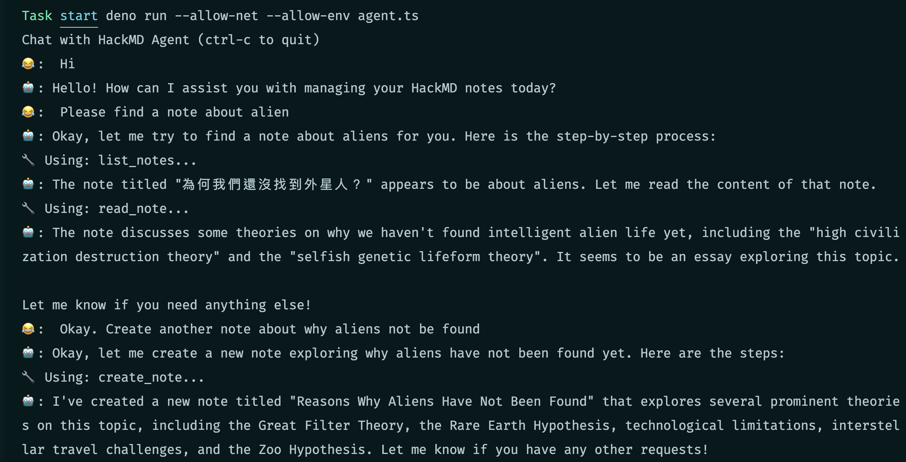

# Tiny HackMD Agent

> This is a simple, super tiny agent for interacting with HackMD notes with Just
> 100+ LOC

Blog post: <https://hackmd.io/@EastSun5566/building-tiny-hackmd-agent>

## Getting Started

- [Deno](https://deno.com/) v2+
- [HackMD API Token](https://hackmd.io/settings#api)
- [Anthropic API Key](https://console.anthropic.com/account/keys)

```bash
HACKMD_API_TOKEN=<YOUR_TOKEN>
ANTHROPIC_API_KEY=<YOUR_KEY>

deno task start
```

## Screenshots


